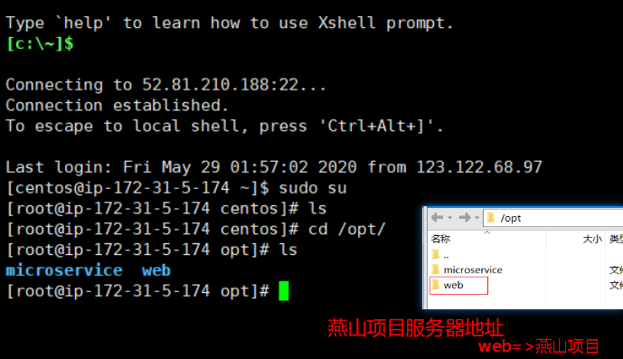

### linux常用命令

```javascript
ls	查询当前linux主机所在目录有哪些文件
scp	复制文件夹	=> scp index.html /opt/web/
rm -rf	强制删除文件目录 =>	rm -rf dome #(慎用！！)
rm -f	强制删除文件	=> rm -f index.html
pwd	显示当前工作目录的路径
ls -a	显示所有文件（包含隐藏文件）
mv	移动文件夹	=>	mv lampp /opt/web/
rz -E	本地文件上传到linux服务器里面
unzip   解压缩包
env   显示所有环境变量
```

### 解压tar.xz文件

````javascript
xz -d dome.tar.xz
tar -xvf dome.tar
````

### 运行.run文件

```javascript
chmod +x realplay.run
./realplay.run
```

### 配置环境变量

````javascript
vim /etc/profile   打开环境变量
i   编辑环境变量
````


### 查看端口号

> netstat -ntulp			查看全部的端口情况
>
> netstat -ntulp | grep 8080			查看具体的端口


> /opt/lampp/./lampp start			启动lampp
>
> /opt/lampp/./lampp stop			停止XAMPP
>
> /opt/lampp/./lampp restart			重启XAMPP
>
> /opt/lampp/./lampp security			安全设置
>
> rm -rf /opt/lampp			卸载XAMPP


### 切换到root用户

```javascript
sudo su
```




